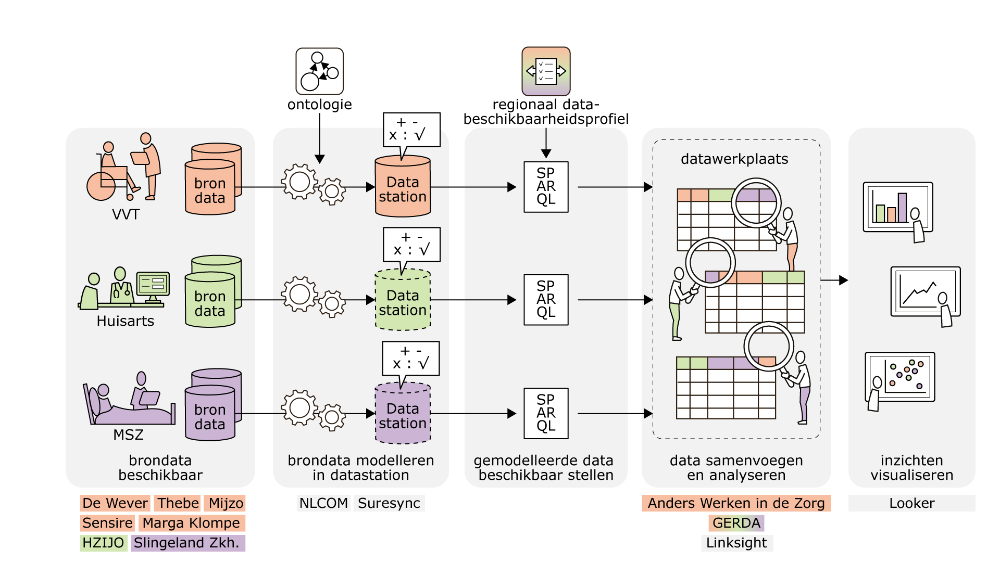
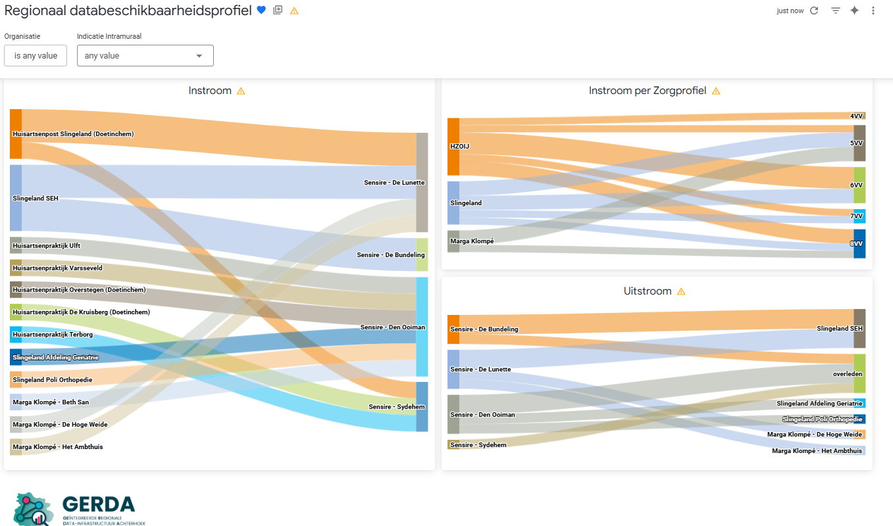

# Regionaal Databeschikbaarheidsprofiel 'In-, door- en uitstroom': technische uitwerking

Deze repository bevat de technische uitwerking van het Regionaal Databeschikbaarheidsprofiel 'In-, door- en uitstroom': de SPARQL-query's, de voorbeelddata en de voorbeelduitkomsten.

Het profiel zelf, met het doel, de dataset, de afspraken over privacy en de functionele uitwerking van de voorbeeldvragen, staat op [datawerkplaats.net](https://datawerkplaats.net/2026/08/11/hergebruik-kik-v-voor-regionale-bevragingen).

Het profiel beschrijft welke gegevens zorgaanbieders in een regionale datawerkplaats beschikbaar stellen om de beweging van cliënten rond de intramurale verpleegzorg te analyseren. De gegevens zijn gemodelleerd volgens de KIK-V ontologie. Het profiel is ontwikkeld en beproefd in een praktijkbeproeving binnen de datawerkplaatsen GERDA (Achterhoek) en Anders Werken in de Zorg (Midden- en West-Brabant).

## Van brondata naar visualisatie



De figuur laat zien hoe gegevens van de bron naar een inzicht gaan. De bestanden in deze repository volgen dezelfde vijf stappen:

| Stap in de figuur | Wat er gebeurt | Bestanden in deze repository |
|---|---|---|
| 1. Brondata beschikbaar | Zorgaanbieders in de verpleegzorg (VVT), de huisartsenzorg en de medisch-specialistische zorg (MSZ) leggen gegevens vast in hun bronsystemen | [`data/dummydata_VVT.csv`](data/dummydata_VVT.csv), [`data/dummydata_HA_MSZ.csv`](data/dummydata_HA_MSZ.csv) |
| 2. Brondata modelleren in het datastation | De brondata wordt gemodelleerd volgens de landelijke definities uit de ontologie | [`data/csv_to_ttl.py`](data/csv_to_ttl.py), [`data/testdata_VVT.ttl`](data/testdata_VVT.ttl), [`data/testdata_HA_MSZ.ttl`](data/testdata_HA_MSZ.ttl) |
| 3. Gemodelleerde data beschikbaar stellen | Een SPARQL-query vraagt op elk datastation dezelfde dataset op en levert die als tabel | [`queries/query_vvt.rq`](queries/query_vvt.rq), [`queries/query_ha_msz.rq`](queries/query_ha_msz.rq), [`queries/query_tijdlijn.rq`](queries/query_tijdlijn.rq) |
| 4. Data samenvoegen en analyseren | De tabellen worden ingelezen in de analyseomgeving van de datawerkplaats, met elkaar verbonden op het identificatienummer en bevraagd voor de analysevragen | [`tabellen/`](tabellen/), [`queries/analyse_instroom.rq`](queries/analyse_instroom.rq), [`queries/analyse_doorstroom.rq`](queries/analyse_doorstroom.rq), [`queries/analyse_uitstroom.rq`](queries/analyse_uitstroom.rq) |
| 5. Inzichten visualiseren | De uitkomsten van de analyses zijn de invoer voor een dashboard | [`voorbeelduitkomsten/`](voorbeelduitkomsten/) |

Er zijn dus twee soorten bevragingen:

- **Bevraging van het datastation (stap 3).** Deze SPARQL-query's halen bij elke zorgaanbieder de dataset op. Zij zijn voor elke regio gelijk, omdat alle datastations de gegevens volgens dezelfde ontologie modelleren.
- **Bevraging in de datawerkplaats (stap 4).** Deze bevragingen beantwoorden een regionale vraag met de samengevoegde dataset van alle deelnemende zorgaanbieders. Met dezelfde dataset kunnen regio's ook andere vragen beantwoorden dan de drie voorbeeldvragen.

Het profiel is niet gebonden aan een leverancier. Elke analyseomgeving en elk dashboard kan worden gebruikt: de dataset en de definities van de voorbeeldvragen blijven gelijk. In de beproeving is Linksight gebruikt als analyseomgeving en heeft GERDA het dashboard gemaakt.

De huisartsenzorg en de medisch-specialistische zorg kennen op dit moment geen KIK-V datastation. In de figuur zijn die datastations daarom gestippeld. In de beproeving is de dummy data voor deze sectoren rechtstreeks in de analyseomgeving geplaatst.

De onderbouwing van het terugkijkvenster van 100 dagen staat in [`lookback_window.md`](lookback_window.md).

## Stap 1 en 2: brondata en gemodelleerde data

Alle personen in de voorbeelddata zijn fictief. De gegevens zijn dummy data en zeggen niets over de genoemde organisaties en locaties.

In [`data/`](data/) staan twee gegevenssets. De CSV-bestanden stellen de brondata voor, de Turtle-bestanden dezelfde gegevens gemodelleerd volgens de ontologie, zoals een datastation ze bevat:

| Bestand | Inhoud | Omvang |
|---|---|---|
| `dummydata_VVT.csv`, `testdata_VVT.ttl` | Intramurale zorgperiodes in de verpleegzorg: persoon, start- en einddatum, locatie, zorgprofiel, leveringsvorm en een eventuele overlijdensdatum | 76 zorgperiodes van 66 personen |
| `dummydata_HA_MSZ.csv`, `testdata_HA_MSZ.ttl` | Zorgcontacten in de huisartsenzorg, de medisch-specialistische zorg en de verpleegzorg: persoon, startdatum, locatie, soort indicatie, sector en een eventuele overlijdensdatum | 100 zorgcontacten van 51 personen |

Dezelfde persoon heeft in beide gegevenssets hetzelfde cliëntnummer. Dat nummer is het identificatienummer waarmee gegevens uit verschillende bronnen worden gecombineerd. In de Turtle-bestanden is het verwerkt in de aanduiding van de persoon (`dummy:Human_<cliëntnummer>`). De KIK-V ontologie kent nog geen eigen begrip voor een identificatienummer.

Elke locatie is gekoppeld aan een organisatie: HZOIJ (huisartsenzorg), Slingeland (medisch-specialistische zorg), Sensire en Marga Klompé (verpleegzorg). De voorbeeldvragen zijn uitgewerkt voor de locaties van Sensire. Personen van wie geen naam is vastgelegd, heten in de voorbeelddata "Cliënt" met hun cliëntnummer.

### Gegevensmodel

| Voorvoegsel | Naamruimte |
|---|---|
| `onz-g` | `http://purl.org/ozo/onz-g#` |
| `onz-zorg` | `http://purl.org/ozo/onz-zorg#` |
| `onz-org` | `http://purl.org/ozo/onz-org#` |
| `ext` | `http://data.dummyzorg.nl/ext#` (eigen uitbreiding van dit profiel) |
| `dummy` | `http://data.dummyzorg.nl/` (de voorbeelddata zelf) |

| Term | Betekenis in dit profiel |
|---|---|
| `onz-g:Human` | De cliënt |
| `onz-zorg:NursingProcess` | Een intramurale zorgperiode in de verpleegzorg |
| `onz-zorg:ZorgProces` | Een zorgcontact bij een huisarts, ziekenhuis of andere zorgaanbieder |
| `onz-zorg:WlzIndicatie`, `onz-zorg:ZvwIndicatie`, `onz-zorg:WmoIndicatie`, `onz-zorg:IndicatieBesluitPartnerverblijf` | De indicatie waarop een zorgperiode of zorgcontact gebaseerd is |
| `onz-zorg:ZorgProfiel`, `onz-zorg:Leveringsvorm` | Zorgprofiel en leveringsvorm, onderdelen van de Wlz-indicatie |
| `onz-org:Vestiging`, `onz-g:Business` | De locatie waar zorg geleverd wordt en de organisatie waar die bij hoort |
| `ext:HACode`, `ext:MSZCode`, `ext:VVTCode` | Eigen uitbreiding: de sector van een zorgcontact |
| `onz-g:hasParticipant` | Verbindt een zorgperiode of zorgcontact met de persoon |
| `onz-g:definedBy` | Verbindt een zorgperiode of zorgcontact met de indicatie of de sectorcodering |
| `onz-g:isAbout` | Verbindt een indicatie met de persoon |
| `onz-g:hasPart` | Verbindt een indicatie met het zorgprofiel en de leveringsvorm |
| `onz-g:hasPerdurantLocation` | Verbindt een zorgperiode of zorgcontact met de vestiging |
| `onz-org:vestigingVan` | Verbindt een vestiging met de organisatie |
| `onz-g:startDatum`, `onz-g:eindDatum` | Start- en einddatum |
| `onz-g:hasDateOfDeath` | Overlijdensdatum van een persoon |

Een intramurale zorgperiode ziet er in Turtle zo uit:

```turtle
dummy:Human_300000001 a onz-g:Human ;
    rdfs:label           "Nijman" ;
    onz-g:hasDateOfDeath "2022-06-29"^^xsd:date .

dummy:Indicatie_WLZ_300000001_1 a onz-zorg:WlzIndicatie ;
    onz-g:isAbout    dummy:Human_300000001 ;
    onz-g:startDatum "2022-05-08"^^xsd:date ;
    onz-g:eindDatum  "2022-06-29"^^xsd:date ;
    onz-g:hasPart    onz-zorg:8VV ;
    onz-g:hasPart    onz-zorg:mpt .

dummy:NursingProcess_300000001_1 a onz-zorg:NursingProcess ;
    onz-g:hasParticipant          dummy:Human_300000001 ;
    onz-g:definedBy               dummy:Indicatie_WLZ_300000001_1 ;
    onz-g:startDatum              "2022-05-08"^^xsd:date ;
    onz-g:eindDatum               "2022-06-29"^^xsd:date ;
    onz-g:hasPerdurantLocation    dummy:Vestiging_Sensire_Sydehem .
```

Een zorgcontact ziet er zo uit:

```turtle
dummy:Contact_100000001_1 a onz-zorg:ZorgProces ;
    onz-g:hasParticipant       dummy:Human_100000001 ;
    onz-g:startDatum           "2023-01-23"^^xsd:date ;
    onz-g:hasPerdurantLocation dummy:Vestiging_Huisartsenpraktijk_Varsseveld ;
    onz-g:definedBy            dummy:Code_100000001_1 ;
    onz-g:definedBy            dummy:Indicatie_100000001_1 .

dummy:Code_100000001_1 a ext:HACode ; rdfs:label "HA" .

dummy:Indicatie_100000001_1 a onz-zorg:ZvwIndicatie ;
    onz-g:isAbout dummy:Human_100000001 .
```

### Van CSV naar Turtle

Het script [`data/csv_to_ttl.py`](data/csv_to_ttl.py) zet de twee CSV-bestanden om naar de twee Turtle-bestanden. Het heeft alleen de standaardbibliotheek van Python nodig en schrijft de uitvoer naast de CSV-bestanden:

```
python3 data/csv_to_ttl.py
```

## Stap 3: de dataset ophalen uit een datastation

Deze query's worden op een datastation uitgevoerd. Zij tellen niet, maar leveren de dataset als tabel met één regel per zorgperiode of zorgcontact. Die tabel wordt in stap 4 ingelezen in de datawerkplaats.

Om dit na te bootsen met de voorbeelddata, wordt elke query uitgevoerd op het Turtle-bestand van de eigen sector. Dat kan in een triplestore, of met Python en [rdflib](https://rdflib.readthedocs.io/):

```python
import rdflib

datastation = rdflib.Graph()
datastation.parse("data/testdata_VVT.ttl")

for rij in datastation.query(open("queries/query_vvt.rq").read()):
    print(*rij, sep=" | ")
```

### Intramurale zorgperiodes uit de verpleegzorg

Bestand: [`queries/query_vvt.rq`](queries/query_vvt.rq), uit te voeren op `data/testdata_VVT.ttl`. De query levert per zorgperiode het cliëntnummer, de persoon, de start- en einddatum, de locatie, het zorgprofiel, de leveringsvorm en een eventuele overlijdensdatum. Op de voorbeelddata zijn dat 76 regels.

```sparql
PREFIX onz-g:    <http://purl.org/ozo/onz-g#>
PREFIX onz-zorg: <http://purl.org/ozo/onz-zorg#>
PREFIX rdfs:     <http://www.w3.org/2000/01/rdf-schema#>
PREFIX xsd:      <http://www.w3.org/2001/XMLSchema#>

SELECT ?clientnummer ?persoon ?startDatum ?einddatum ?locatie ?zorgprofiel ?leveringsvorm ?overlijdensdatum
WHERE {
    ?human a onz-g:Human ;
           rdfs:label ?persoon .

    ?np a onz-zorg:NursingProcess ;
        onz-g:hasParticipant ?human ;
        onz-g:startDatum ?startDatum ;
        onz-g:hasPerdurantLocation/rdfs:label ?locatie ;
        onz-g:definedBy ?ind .

    OPTIONAL { ?np onz-g:eindDatum ?einddatum }
    OPTIONAL { ?human onz-g:hasDateOfDeath ?overlijdensdatum }

    ?ind onz-g:hasPart ?zp .
    ?zp a onz-zorg:ZorgProfiel .
    BIND(STRAFTER(STR(?zp), "#") AS ?zorgprofiel)

    ?ind onz-g:hasPart ?lv .
    ?lv a onz-zorg:Leveringsvorm .
    BIND(STRAFTER(STR(?lv), "#") AS ?leveringsvorm)

    BIND(STRAFTER(STR(?human), "Human_") AS ?clientnummer)
}
ORDER BY ?clientnummer ?startDatum
```

### Zorgcontacten uit de huisartsenzorg en de medisch-specialistische zorg

Bestand: [`queries/query_ha_msz.rq`](queries/query_ha_msz.rq), uit te voeren op `data/testdata_HA_MSZ.ttl`. De query levert per zorgcontact het cliëntnummer, de naam, de startdatum, de locatie, de sector, de soort indicatie en een eventuele overlijdensdatum. Op de voorbeelddata zijn dat 100 regels.

```sparql
PREFIX onz-g:    <http://purl.org/ozo/onz-g#>
PREFIX onz-zorg: <http://purl.org/ozo/onz-zorg#>
PREFIX ext:      <http://data.dummyzorg.nl/ext#>
PREFIX rdfs:     <http://www.w3.org/2000/01/rdf-schema#>
PREFIX xsd:      <http://www.w3.org/2001/XMLSchema#>

SELECT ?clientnummer ?naam ?startdatum ?locatie ?codeType ?indicatie ?overlijdensdatum
WHERE {
    ?human a onz-g:Human ;
           rdfs:label ?naam .

    ?contact a onz-zorg:ZorgProces ;
             onz-g:hasParticipant ?human ;
             onz-g:startDatum ?startdatum ;
             onz-g:hasPerdurantLocation/rdfs:label ?locatie .

    OPTIONAL {
        ?contact onz-g:definedBy ?code .
        ?code a ?codeClass .
        FILTER(STRSTARTS(STR(?codeClass), STR(ext:)))
        BIND(STRAFTER(STR(?codeClass), "#") AS ?codeType)
    }

    OPTIONAL {
        ?contact onz-g:definedBy ?ind .
        ?ind a ?indClass .
        FILTER(?indClass IN (
            onz-zorg:WlzIndicatie,
            onz-zorg:ZvwIndicatie,
            onz-zorg:WmoIndicatie,
            onz-zorg:IndicatieBesluitPartnerverblijf
        ))
        BIND(STRAFTER(STR(?indClass), "#") AS ?indicatie)
    }

    OPTIONAL { ?human onz-g:hasDateOfDeath ?overlijdensdatum }

    BIND(STRAFTER(STR(?human), "Human_") AS ?clientnummer)
}
ORDER BY ?clientnummer ?startdatum
```

### Tijdlijn per persoon

Bestand: [`queries/query_tijdlijn.rq`](queries/query_tijdlijn.rq). Deze query levert per intramurale periode één regel met het laatste zorgcontact in de 100 dagen ervoor, de periode zelf en het eerste zorgcontact erna. De query heeft de zorgperiodes en de zorgcontacten samen nodig en wordt dus uitgevoerd waar die gegevens bij elkaar staan. Overlijden en doorstroom blijven in deze query buiten beschouwing.

```sparql
PREFIX onz-g:    <http://purl.org/ozo/onz-g#>
PREFIX onz-zorg: <http://purl.org/ozo/onz-zorg#>
PREFIX onz-org:  <http://purl.org/ozo/onz-org#>
PREFIX ext:      <http://data.dummyzorg.nl/ext#>
PREFIX rdf:      <http://www.w3.org/1999/02/22-rdf-syntax-ns#>
PREFIX rdfs:     <http://www.w3.org/2000/01/rdf-schema#>
PREFIX xsd:      <http://www.w3.org/2001/XMLSchema#>

SELECT ?persoon
       ?voorStart ?voorLocatie ?voorCodeLabel ?voorIndicatie
       ?wlzStart ?wlzEind ?zorgprofiel ?leveringsvorm ?locatie
       ?naStart ?naLocatie ?naCodeLabel ?naIndicatie
WHERE {
    # In de zorg
    ?nursingProces a onz-zorg:NursingProcess ;
                   onz-g:hasParticipant ?persoon ;
                   onz-g:definedBy ?indicatie ; # WLZ-indicatie, subclass van indicatiebesluit
                   onz-g:startDatum ?wlzStart . # startDatum ZorgProces
    OPTIONAL { ?nursingProces onz-g:eindDatum ?wlzEind }

    # Zorgprofiel en leveringsvorm
    ?indicatie onz-g:hasPart ?zorgprofiel .
    ?zorgprofiel a onz-zorg:ZorgProfiel .
    ?indicatie onz-g:hasPart ?leveringsvorm .
    ?leveringsvorm a onz-zorg:Leveringsvorm .

     OPTIONAL { ?nursingProces onz-g:hasPerdurantLocation/rdfs:label ?locatie }

    # Voor de zorg (100 dagen)
    OPTIONAL {
        ?voorProces a onz-zorg:ZorgProces ;
                    onz-g:hasParticipant ?persoon ;
                    onz-g:startDatum ?voorStart . # geen indicatiebesluit.
        FILTER (?voorStart < ?wlzStart &&
                ?voorStart >= ?wlzStart - "P100D"^^xsd:dayTimeDuration)
        FILTER NOT EXISTS { # laatste zorgcontact als instroom
            ?andereVoor a onz-zorg:ZorgProces ;
                        onz-g:hasParticipant ?persoon ;
                        onz-g:startDatum ?andereStart .
            FILTER (?andereStart < ?wlzStart && ?andereStart > ?voorStart)
        }
        OPTIONAL { ?voorProces onz-g:hasPerdurantLocation/rdfs:label ?voorLocatie }
        OPTIONAL { ?voorProces onz-g:definedBy ?voorCodering .
                   ?voorCodering rdfs:label ?voorCodeLabel }
        OPTIONAL { ?voorProces onz-g:definedBy ?voorIndicatie .
                    ?voorIndicatie a onz-zorg:IndicatieBesluit .
        }
    }

    # Na de zorg
    OPTIONAL {
        ?naProces a onz-zorg:ZorgProces ;
                  onz-g:hasParticipant ?persoon ;
                  onz-g:startDatum ?naStart .
        FILTER BOUND(?wlzEind)
        FILTER (?naStart > ?wlzEind)
        FILTER NOT EXISTS {
            ?andereNa a onz-zorg:ZorgProces ;
                onz-g:hasParticipant ?persoon ;
                onz-g:startDatum ?andereStart .
            FILTER(?andereStart > ?wlzEind &&
                    ?andereStart < ?naStart )
        }
        OPTIONAL { ?naProces onz-g:hasPerdurantLocation/rdfs:label ?naLocatie }
        OPTIONAL { ?naProces onz-g:definedBy ?naCodering .
                   ?naCodering rdfs:label ?naCodeLabel }
        OPTIONAL { ?naProces onz-g:definedBy ?naIndicatie .
                    ?naIndicatie a onz-zorg:IndicatieBesluit }
    }
}
ORDER BY ?persoon ?wlzStart
```

## Stap 4: samenvoegen en analyseren in de datawerkplaats

### De dataset inlezen

De tabellen uit de datastations worden ingelezen in de analyseomgeving van de datawerkplaats. In [`tabellen/`](tabellen/) is te zien hoe dat eruitziet: per organisatie de tabellen als CSV-bestand, met een metadatabeschrijving (JSON) die de analyseomgeving vertelt welke kolommen er zijn en wat ermee mag. De metadatabeschrijvingen hebben het formaat van de analyseomgeving uit de beproeving; een andere analyseomgeving legt hetzelfde op zijn eigen manier vast.

| Metadatabeschrijving | CSV-bestanden | Inhoud |
|---|---|---|
| `HZOIJ huisartsen - Regionaal Databeschikbaarheidsprofiel mock-up brondata.json` | `hzoij_huisartsen_clienten.csv`, `hzoij_huisartsen.csv` | Zorgcontacten bij huisartsenpraktijken en de huisartsenpost |
| `Slingeland Ziekenhuis - Regionaal Databeschikbaarheidsprofiel mock-up brondata.json` | `slingeland_msz_clienten.csv`, `slingeland_msz.csv` | Zorgcontacten op de polikliniek, de spoedeisende hulp en de afdeling geriatrie |
| `Sensire - Instroom-Doorstroom-Uitstroom met overlijden en herindicatie.json` | `sensire-clienten.csv`, `sensire-zorgdata.csv` | Intramurale periodes met per periode de instroom, doorstroom en uitstroom |
| `Marga Klompé - Instroom-Doorstroom-Uitstroom met overlijden en herindicatie.json` | `marga-klompé-clienten.csv`, `marga-klompé-zorgdata.csv` | Intramurale periodes met per periode de instroom, doorstroom en uitstroom |

De metadatabeschrijvingen leggen per kolom vast of die mag worden opgevraagd en of erop mag worden gefilterd. Het cliëntnummer en de naam zijn afgeschermd: zij dienen om gegevens te verbinden, niet om te tonen.

De tabellen bevatten dezelfde personen, zorgperiodes en zorgcontacten als de bestanden in `data/`. De locatie van een intramurale periode staat in de tabellen zonder de naam van de organisatie ervoor.

Per intramurale periode bevatten de tabellen daarnaast afgeleide kolommen, waarop in de analyseomgeving en in een dashboard gegroepeerd en gefilterd kan worden:

| Afgeleide kolommen | Inhoud |
|---|---|
| `wlz_start_jaar`, `verblijfsduur_dagen`, `verblijfsduur_klasse` | Het jaar waarin de periode begon en de verblijfsduur, in dagen en in klassen van korter dan een maand tot langer dan twee jaar |
| `instroom_type` | De herkomst: nieuw, eigen zorgcontact, herindicatie of heropname |
| `uitstroom_reden` | De reden van uitstroom: nog in zorg, overleden, herindicatie, doorstroom naar een eigen zorgcontact, uitstroom naar het ziekenhuis of onbekend |
| `voor_start`, `voor_sector`, `voor_locatie`, `na_start`, `na_sector`, `na_locatie` | Het laatste zorgcontact bij de eigen organisatie in de 100 dagen vóór de periode en het eerste erna |
| `vorige_zorgprofiel`, `vorige_wlz_eind`, `vorige_locatie`, `volgende_zorgprofiel`, `volgende_wlz_start`, `volgende_locatie` | De intramurale periode die direct voorafgaat aan of aansluit op de periode |

De soort instroom en de reden van uitstroom zijn per zorgaanbieder vastgesteld met wat die zorgaanbieder zelf weet. "Nieuw" betekent dus dat er geen eerder zorgcontact bij deze zorgaanbieder was; de cliënt kan elders in zorg zijn geweest. Pas in de datawerkplaats, waar de gegevens van de zorgaanbieders worden samengevoegd, wordt de beweging tussen zorgaanbieders zichtbaar.

### De voorbeeldvragen

In de datawerkplaats worden de gegevens van de verschillende zorgaanbieders met elkaar verbonden op het identificatienummer. Daarna worden de analysevragen gesteld.

De drie voorbeeldvragen zijn hier uitgewerkt in SPARQL, op de samengevoegde gemodelleerde data. Daarmee ligt vast wat de analyse precies berekent, en is de uitkomst zonder analyseomgeving te controleren. In een datawerkplaats wordt dezelfde berekening uitgevoerd in de taal van de analyseomgeving, op de ingelezen tabellen.

Om de query's uit te voeren, worden beide Turtle-bestanden samen geladen:

```python
import rdflib

datawerkplaats = rdflib.Graph()
datawerkplaats.parse("data/testdata_HA_MSZ.ttl")
datawerkplaats.parse("data/testdata_VVT.ttl")

for rij in datawerkplaats.query(open("queries/analyse_instroom.rq").read()):
    print(*rij, sep=" | ")
```

De query's voor instroom en uitstroom hebben beide bestanden nodig. De query voor doorstroom gebruikt alleen de gegevens uit de verpleegzorg.

De regel `FILTER(STRSTARTS(..., "Sensire - "))` bepaalt in elke query voor welke zorgaanbieder de vraag gesteld wordt. Voor een andere zorgaanbieder wordt deze regel aangepast.

De query's tellen unieke cliënten over alle periodes in de data. Om de ontwikkeling in de tijd te volgen, kan de uitkomst worden uitgesplitst naar bijvoorbeeld het jaar waarin de periode begint of eindigt. Die uitsplitsing zit niet in de query's.

#### 1. Hoe ontwikkelt de instroom van cliënten per zorgprofiel?

Bestand: [`queries/analyse_instroom.rq`](queries/analyse_instroom.rq). Uitkomst: [`voorbeelduitkomsten/instroom.csv`](voorbeelduitkomsten/instroom.csv).

De query telt per zorgprofiel vanuit welke zorgaanbieder en locatie cliënten instromen op een intramurale locatie. Instroom is het laatste zorgcontact van een persoon vóór de start van een intramurale periode, binnen het terugkijkvenster van 100 dagen. Als de persoon tussen dat contact en de start al een eerdere intramurale periode heeft afgesloten, telt de periode niet als instroom.

- **Concepten**: `onz-g:Human`, `onz-zorg:NursingProcess`, `onz-zorg:ZorgProces`, `onz-zorg:ZorgProfiel`, `onz-org:Vestiging`.
- **Relaties**: `onz-g:hasParticipant`, `onz-g:definedBy`, `onz-g:hasPart`, `onz-g:hasPerdurantLocation`, `onz-org:vestigingVan`.
- **Eigenschappen**: `onz-g:startDatum`, `onz-g:eindDatum`, `rdfs:label`.
- **Parameters**: de zorgaanbieder (`"Sensire - "`) en het terugkijkvenster (`"P100D"`).

```sparql
PREFIX onz-g:    <http://purl.org/ozo/onz-g#>
PREFIX onz-org:  <http://purl.org/ozo/onz-org#>
PREFIX onz-zorg: <http://purl.org/ozo/onz-zorg#>
PREFIX rdfs:     <http://www.w3.org/2000/01/rdf-schema#>
PREFIX xsd:      <http://www.w3.org/2001/XMLSchema#>

# Instroom: laatste zorgcontact binnen 100 dagen voor de start van een intramurale periode.
# Levert instroom.csv op (testdata_HA_MSZ.ttl + testdata_VVT.ttl samen laden).
SELECT ?organisatieInstroom ?locatieInstroom ?locatieIntramuraal ?indicatieIntramuraal (COUNT(DISTINCT ?persoon) AS ?aantalClienten)
WHERE {
    ?np a onz-zorg:NursingProcess ;
        onz-g:hasParticipant ?persoon ;
        onz-g:definedBy ?ind ;
        onz-g:startDatum ?start ;
        onz-g:hasPerdurantLocation/rdfs:label ?locatieIntramuraal .
    FILTER(STRSTARTS(?locatieIntramuraal, "Sensire - "))

    ?ind onz-g:hasPart ?zp .
    ?zp a onz-zorg:ZorgProfiel .
    BIND(STRAFTER(STR(?zp), "#") AS ?indicatieIntramuraal)

    ?voor a onz-zorg:ZorgProces ;
          onz-g:hasParticipant ?persoon ;
          onz-g:startDatum ?voorStart ;
          onz-g:hasPerdurantLocation ?vestigingInstroom .
    ?vestigingInstroom rdfs:label ?locatieInstroom .
    OPTIONAL { ?vestigingInstroom onz-org:vestigingVan/rdfs:label ?organisatieInstroom }
    FILTER(?voorStart < ?start && ?voorStart >= ?start - "P100D"^^xsd:dayTimeDuration)

    # alleen het laatste contact voor de start
    FILTER NOT EXISTS {
        ?ander a onz-zorg:ZorgProces ;
               onz-g:hasParticipant ?persoon ;
               onz-g:startDatum ?anderStart .
        FILTER(?anderStart > ?voorStart && ?anderStart < ?start)
    }
    # geen instroom als de client tussendoor al intramuraal verbleef (doorstroom)
    FILTER NOT EXISTS {
        ?eerder a onz-zorg:NursingProcess ;
                onz-g:hasParticipant ?persoon ;
                onz-g:eindDatum ?eerderEind .
        FILTER(?eerderEind >= ?voorStart && ?eerderEind < ?start)
    }
}
GROUP BY ?organisatieInstroom ?locatieInstroom ?locatieIntramuraal ?indicatieIntramuraal
ORDER BY ?organisatieInstroom ?locatieIntramuraal ?indicatieIntramuraal ?locatieInstroom
```

#### 2. Hoe ontwikkelt de doorstroom van cliënten?

Bestand: [`queries/analyse_doorstroom.rq`](queries/analyse_doorstroom.rq). Uitkomst: [`voorbeelduitkomsten/doorstroom.csv`](voorbeelduitkomsten/doorstroom.csv).

De query telt hoeveel cliënten binnen de intramurale zorg een ander zorgprofiel krijgen. Doorstroom is de overgang van een intramurale periode naar een aansluitende intramurale periode van dezelfde persoon, waarbij het zorgprofiel verandert. De volgende periode begint ná de einddatum van de vorige en uiterlijk 14 dagen daarna. Een latere heropname telt niet als doorstroom.

- **Concepten**: `onz-g:Human`, `onz-zorg:NursingProcess`, `onz-zorg:ZorgProfiel`.
- **Relaties**: `onz-g:hasParticipant`, `onz-g:definedBy`, `onz-g:hasPart`, `onz-g:hasPerdurantLocation`.
- **Eigenschappen**: `onz-g:startDatum`, `onz-g:eindDatum`, `rdfs:label`.
- **Parameters**: de zorgaanbieder (`"Sensire - "`) en de termijn waarbinnen de volgende periode aansluit (`"P14D"`).

```sparql
PREFIX onz-g:    <http://purl.org/ozo/onz-g#>
PREFIX onz-zorg: <http://purl.org/ozo/onz-zorg#>
PREFIX rdfs:     <http://www.w3.org/2000/01/rdf-schema#>
PREFIX xsd:      <http://www.w3.org/2001/XMLSchema#>

# Doorstroom: aansluitende intramurale periodes van dezelfde client met een ander zorgprofiel.
# De volgende periode begint binnen 14 dagen na het einde van de vorige.
# Levert doorstroom.csv op (testdata_VVT.ttl).
SELECT ?soortDoorstroom ?van ?naar (COUNT(DISTINCT ?persoon) AS ?aantalClienten)
WHERE {
    ?np1 a onz-zorg:NursingProcess ;
         onz-g:hasParticipant ?persoon ;
         onz-g:definedBy ?ind1 ;
         onz-g:eindDatum ?eind1 ;
         onz-g:hasPerdurantLocation/rdfs:label ?locatie1 .
    FILTER(STRSTARTS(?locatie1, "Sensire - "))
    ?ind1 onz-g:hasPart ?zp1 .
    ?zp1 a onz-zorg:ZorgProfiel .

    ?np2 a onz-zorg:NursingProcess ;
         onz-g:hasParticipant ?persoon ;
         onz-g:definedBy ?ind2 ;
         onz-g:startDatum ?start2 .
    FILTER(?start2 > ?eind1 && ?start2 <= ?eind1 + "P14D"^^xsd:dayTimeDuration)
    ?ind2 onz-g:hasPart ?zp2 .
    ?zp2 a onz-zorg:ZorgProfiel .
    FILTER(?zp1 != ?zp2)

    # np2 is de direct volgende periode
    FILTER NOT EXISTS {
        ?tussen a onz-zorg:NursingProcess ;
                onz-g:hasParticipant ?persoon ;
                onz-g:startDatum ?tussenStart .
        FILTER(?tussenStart > ?eind1 && ?tussenStart < ?start2)
    }

    BIND("herindicatie" AS ?soortDoorstroom)
    BIND(LCASE(STRAFTER(STR(?zp1), "#")) AS ?van)
    BIND(LCASE(STRAFTER(STR(?zp2), "#")) AS ?naar)
}
GROUP BY ?soortDoorstroom ?van ?naar
ORDER BY ?van ?naar
```

#### 3. Hoe ontwikkelt de uitstroom van cliënten, bijvoorbeeld door overlijden of andere uitstroomredenen?

Bestand: [`queries/analyse_uitstroom.rq`](queries/analyse_uitstroom.rq). Uitkomst: [`voorbeelduitkomsten/uitstroom.csv`](voorbeelduitkomsten/uitstroom.csv).

De query telt per zorgprofiel naar welke zorgaanbieder en locatie cliënten uitstromen, of dat de intramurale periode is geëindigd door overlijden. Uitstroom is de eerste gebeurtenis na het einde van een intramurale periode: een zorgcontact of het overlijden van de persoon. Als de persoon eerst een nieuwe intramurale periode begint, telt de periode niet als uitstroom.

- **Concepten**: `onz-g:Human`, `onz-zorg:NursingProcess`, `onz-zorg:ZorgProces`, `onz-zorg:ZorgProfiel`, `onz-org:Vestiging`.
- **Relaties**: `onz-g:hasParticipant`, `onz-g:definedBy`, `onz-g:hasPart`, `onz-g:hasPerdurantLocation`, `onz-org:vestigingVan`.
- **Eigenschappen**: `onz-g:startDatum`, `onz-g:eindDatum`, `onz-g:hasDateOfDeath`, `rdfs:label`.
- **Parameters**: de zorgaanbieder (`"Sensire - "`).

```sparql
PREFIX onz-g:    <http://purl.org/ozo/onz-g#>
PREFIX onz-org:  <http://purl.org/ozo/onz-org#>
PREFIX onz-zorg: <http://purl.org/ozo/onz-zorg#>
PREFIX rdfs:     <http://www.w3.org/2000/01/rdf-schema#>

# Uitstroom: eerste zorgcontact of overlijden na het einde van een intramurale periode.
# Levert uitstroom.csv op (testdata_HA_MSZ.ttl + testdata_VVT.ttl samen laden).
SELECT ?organisatieUitstroom ?locatieUitstroom ?locatieIntramuraal ?indicatieIntramuraal (COUNT(DISTINCT ?persoon) AS ?aantalClienten)
WHERE {
    ?np a onz-zorg:NursingProcess ;
        onz-g:hasParticipant ?persoon ;
        onz-g:definedBy ?ind ;
        onz-g:eindDatum ?eind ;
        onz-g:hasPerdurantLocation ?vestigingIntramuraal .
    ?vestigingIntramuraal rdfs:label ?locatieIntramuraal .
    FILTER(STRSTARTS(?locatieIntramuraal, "Sensire - "))

    ?ind onz-g:hasPart ?zp .
    ?zp a onz-zorg:ZorgProfiel .
    BIND(STRAFTER(STR(?zp), "#") AS ?indicatieIntramuraal)

    # uitstroom is een zorgcontact of overlijden
    {
        ?na a onz-zorg:ZorgProces ;
            onz-g:hasParticipant ?persoon ;
            onz-g:startDatum ?naStart ;
            onz-g:hasPerdurantLocation ?vestigingUitstroom .
        ?vestigingUitstroom rdfs:label ?locatieUitstroom .
        OPTIONAL { ?vestigingUitstroom onz-org:vestigingVan/rdfs:label ?organisatieContact }
    } UNION {
        ?persoon onz-g:hasDateOfDeath ?naStart .
        BIND(true AS ?overleden)
        BIND("overleden" AS ?locatieUitstroom)
    }
    # bij overlijden is de organisatie die van de intramurale vestiging
    OPTIONAL { ?vestigingIntramuraal onz-org:vestigingVan/rdfs:label ?organisatieIntramuraal }
    BIND(IF(BOUND(?overleden), ?organisatieIntramuraal, ?organisatieContact) AS ?organisatieUitstroom)

    # een periode kan eindigen op de dag van overlijden
    FILTER(IF(BOUND(?overleden), ?naStart >= ?eind, ?naStart > ?eind))

    # alleen de eerste gebeurtenis na het einde
    FILTER NOT EXISTS {
        ?ander a onz-zorg:ZorgProces ;
               onz-g:hasParticipant ?persoon ;
               onz-g:startDatum ?anderStart .
        FILTER(?anderStart > ?eind && ?anderStart < ?naStart)
    }
    FILTER NOT EXISTS {
        ?persoon onz-g:hasDateOfDeath ?doodsdatum .
        FILTER(?doodsdatum >= ?eind && ?doodsdatum < ?naStart)
    }
    # geen uitstroom als er eerst een nieuwe intramurale periode volgt (doorstroom)
    FILTER NOT EXISTS {
        ?volgend a onz-zorg:NursingProcess ;
                 onz-g:hasParticipant ?persoon ;
                 onz-g:startDatum ?volgendStart .
        FILTER(?volgendStart > ?eind && ?volgendStart <= ?naStart)
    }
}
GROUP BY ?organisatieUitstroom ?locatieUitstroom ?locatieIntramuraal ?indicatieIntramuraal
ORDER BY ?organisatieUitstroom ?locatieUitstroom ?locatieIntramuraal ?indicatieIntramuraal
```

## Stap 5: visualiseren

De uitkomsten van de drie voorbeeldvragen staan in [`voorbeelduitkomsten/`](voorbeelduitkomsten/): `instroom.csv`, `doorstroom.csv` en `uitstroom.csv`. Elk bestand bevat tellingen van unieke cliënten per herkomst of bestemming, intramurale locatie en zorgprofiel. Deze bestanden zijn de invoer voor een dashboard. De afbeelding toont een voorbeeld, gemaakt door GERDA: de instroom per locatie, de instroom per zorgprofiel en de uitstroom, elk als stroomdiagram.



## Aandachtspunten

- **Klassenamen.** Zorgcontacten zijn gemodelleerd als `onz-zorg:ZorgProces` en intramurale periodes als `onz-zorg:NursingProcess`. Het landelijke KIK-V-uitwisselprofiel van de IGJ bevraagt zorgprocessen via de klasse `onz-g:CureAndCareProcess`. Ga voor gebruik op een productiedatastation na welke klassenamen daar gelden.
- **Rekenen met datums.** De query's rekenen met datums en tijdsduren, genoteerd als `xsd:dayTimeDuration`. Dat is geen onderdeel van de SPARQL-standaard zelf. Controleer of de eigen omgeving dit ondersteunt.
- **Typering van zorgprofiel en leveringsvorm.** De query's verwachten dat zorgprofielen en leveringsvormen getypeerd zijn als `onz-zorg:ZorgProfiel` en `onz-zorg:Leveringsvorm`. In de bestanden in `data/` is dat zo. Bij data waarin die typering ontbreekt, wordt de ontologie erbij geladen.
- **Kleine aantallen.** De voorbeelduitkomsten bevatten regels met één cliënt. Bij gebruik met echte gegevens kunnen zulke kleine aantallen herleidbaar zijn tot personen.

## Licentie

De inhoud van deze repository is beschikbaar onder de licentie [Creative Commons Naamsvermelding 4.0 Internationaal (CC BY 4.0)](https://creativecommons.org/licenses/by/4.0/deed.nl). De volledige tekst staat in [`LICENSE`](LICENSE).
